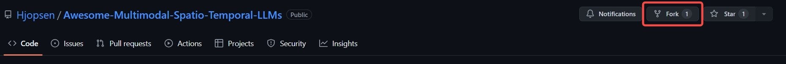
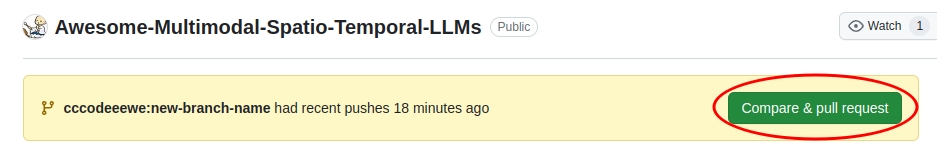

# :seedling: How to participate in this awesome

## 1. Fork our repository

First, fork our GitHub repository so that you can make changes to your own copy. Click the Fork button in the upper right corner of the page.



## 2. Clone Your Fork

Clone your forked repository to your local machine:

```bash
git clone https://github.com/your-username/Awesome-Multimodal-Spatio-Temporal-LLMs.git
```

Navigate into the cloned repository directory:

```bash
cd Awesome-Multimodal-Spatio-Temporal-LLMs
```

## 3. Set Upstream Remote

Add the original repository as a remote to keep your fork in sync with the upstream repository:

```bash
git remote add upstream https://github.com/Hjopsen/Awesome-Multimodal-Spatio-Temporal-LLMs.git
```

## 4. Create a New Branch

Before making any changes, create a new branch:

```bash
git checkout -b your-new-branch
```

## 5. Make Your Changes

Make the desired changes on your new branch. You are welcome to add new multimodal works, fix errors, or make any other modifications that help make this awesome more useful or interesting. Thank you for your contributions.

## 6. Commit Your Changes

Stage and commit your changes:

```bash
git add .
git commit -m "Description of your changes"
```

## 7. Push Your Changes

Push your changes to your forked GitHub repository:

```bash
git push origin your-feature-branch
```

## 8. Create a Pull Request

1. Go to the GitHub page of your forked repository. 
2. Click the Compare & pull request button.



3. Add a detailed description of your changes.
4. Click the Create pull request button.

## 9. Synchronize with Upstream

While waiting for your pull request to be processed, you can keep your fork up to date with the upstream repository:

```bash
git fetch upstream
git checkout main
git merge upstream/main
```

If there are any conflicts, resolve them and commit the changes:

```bash
git add .
git commit -m "Resolve merge conflicts"
git push origin main
```

We will review your pull request within **24 hours**. Thank you for your contributions again!
